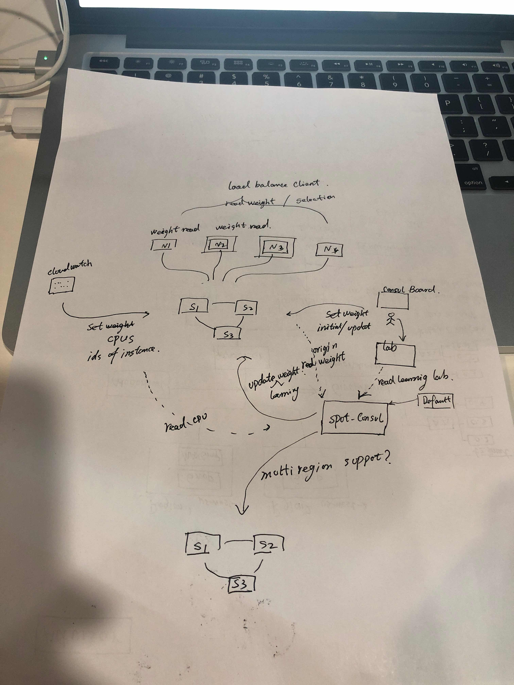
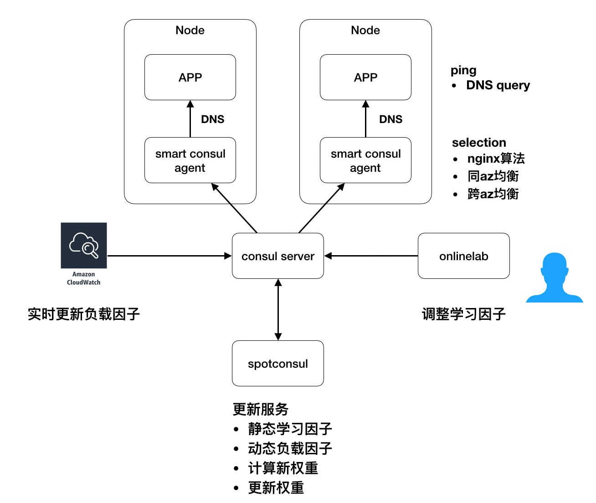

# spot-consul
基于consul的，在aws竞价实例、弹性伸缩组环境下，自适应负载均衡实现方案。

# 背景
当前的负载均衡有以下几大卖点：
1. 权重自适应学习
2. 在线策略控制
3. 客户端Nginx权重选择算法

但存在几个问题，相对于服务端学习控制讲：
1. 学习放在客户端，每种语言客户端实现就得重新实现一遍
2. 容易引起客户端的共振，且共振的解决不如服务端控制力强
3. 客户端复杂带来一些锁和开销
4. 负载均衡的算法升级需要客户端升级，而客户端集成到业务系统里，业务系统还需要升级，这是不太现实的

# 目标
* 实现服务端权重控制
* 客户端均衡算法下沉至consul agent

# 方案历程
## 1 权重学习服务端
这个没什么好说的，权重学习放在集中服务端来完成

## 2 均衡客户端
### 2.1 SDK方式
如当前线上以及上述设计即为客户端sdk方式，提供给客户一份含有随机算法的sdk，客户通过api选择一个ip做请求。
* 优点：成本低（多语言支持也不低其实），常见方式，客户易理解；
* 缺点：客户入侵，需要调用sdk api完成；且多语言问题没有解决；

### 2.2 Proxy方式
本地代理服务器负责转发所有客户请求，代理负责完成均衡算法。
* 优点：实现了客户透明化，客户易理解；
* 缺点：类nginx方式代理服务器接管流量，有兼容协议、吞吐量、可靠性等问题或风险；同时需要与consul agent共存，
无法替代agent的gossip kv等协议功能；

### 2.3 DNS方式
客户只需要connect("service-name.consul.com")，即可获取到dns解析ip进行直连
* 优点：客户入侵最小，几乎没有，通过域名即可查到ip；
* 缺点：实现方案有挑战。挑战是：客户端能否替代consul agent，这样对于用户角度只需要面向一个DNS，用户获得
哪个IP是均衡算法透明的，最大限度减少了用户侧的集成。如果不能替代consul agent那要提供额外的dns server，
这个server同agent并存，可能给用户感觉部署监控复杂的印象；

# 设计草图

# 部署框图

# 模块图

